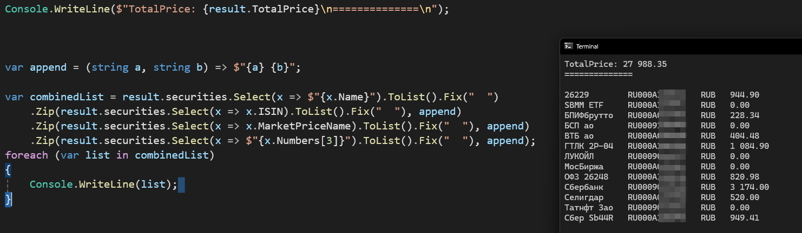

# BrokersReport.Sber

### Example
```cs

using BrokersReport.Sber;
using TestPrint;

ReportParser reportParser = new ReportParser();
reportParser.Path = @"C:\Users\UnderKo\Downloads\aasd.html";

var result = await reportParser.ParseAsync();

Console.WriteLine($"TotalPrice: {result.TotalPrice}\n==============\n");

var append = (string a, string b) => $"{a} {b}";

var combinedList = result.securities.Select(x => $"{x.Name}").ToList().Fix("  ")
    .Zip(result.securities.Select(x => x.ISIN).ToList().Fix("  "), append)
    .Zip(result.securities.Select(x => x.MarketPriceName).ToList().Fix("  "), append)
    .Zip(result.securities.Select(x => $"{x.Numbers[3]}").ToList().Fix("  "), append);
foreach (var list in combinedList)
{
    Console.WriteLine(list);
}

```

